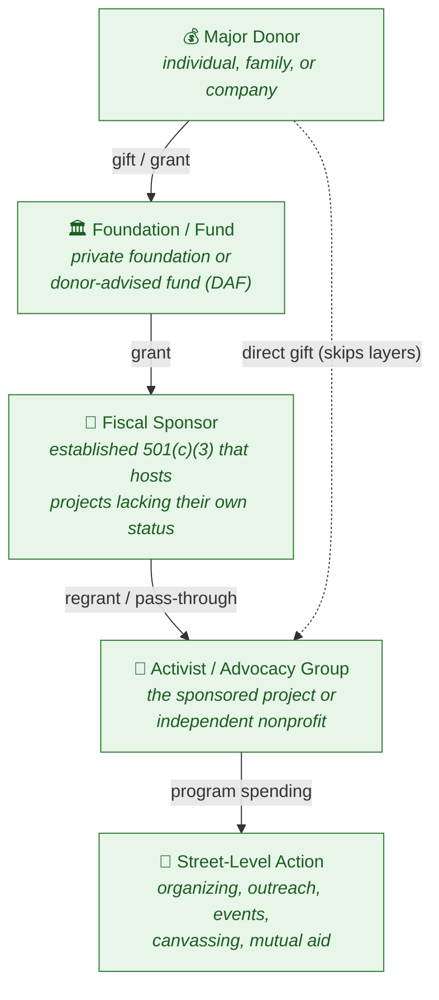

# How Money Flows: Donor → Street-Level Action

*An educational overview of how funds commonly move through the nonprofit /
advocacy ecosystem. This is conceptual learning material — it describes
legitimate, well-established mechanisms and the transparency rules that govern
them.*

## The chain at a glance

## What each stage is and why it exists

| Stage | What it is | Why it's used (legitimate purpose) |
|-------|-----------|-----------------------------------|
| **Major Donor** | An individual, family, or corporation giving a significant sum. | Wants impact and often a tax deduction for charitable giving. |
| **Foundation / Fund** | A private foundation or a **donor-advised fund (DAF)** at a sponsoring charity. | Lets a donor commit money now, deduct it now, and grant it out over time; provides staff/grant-making expertise. |
| **Fiscal Sponsor** | An existing 501(c)(3) that "hosts" a project which doesn't have its own tax-exempt status. | A new group can receive tax-deductible grants and operate **before/without** forming its own nonprofit; the sponsor handles compliance, accounting, and oversight. |
| **Activist / Advocacy Group** | The actual organizing entity (a sponsored project or an independent nonprofit). | Runs the mission work. |
| **Street-Level Action** | The on-the-ground program: canvassing, community events, voter registration, mutual aid, public education. | The point where money becomes activity. |

## Key things this structure is *for*

- **Tax efficiency & timing** — DAFs and foundations let donors separate *when they give* from *when the money is spent*.
- **Lowering the barrier to entry** — fiscal sponsorship lets small or brand-new groups operate without months of IRS paperwork.
- **Pooled expertise & compliance** — intermediaries provide accounting, legal review, and grant management that a grassroots group may lack.
- **Pooled funding** — many donors' money can be combined and regranted strategically.

## The transparency rules that govern it

These layers are **not** a way to make money untraceable. In the U.S.:

- **Form 990** — public foundations and most nonprofits file annual returns listing grants made and recipients (Schedule I).
- **DAF reporting** — the sponsoring organization reports grants out of the fund.
- **Lobbying / political limits** — 501(c)(3)s face strict limits on lobbying and a ban on partisan campaign activity; crossing into political spending triggers separate disclosure regimes (e.g., 501(c)(4), PACs, FEC rules).
- **Anti–money-laundering & "earmarking" rules** — sponsors must exercise real control over funds; donors can't use a charity purely as a conduit to a pre-chosen non-charitable end.

> **Why this matters for understanding the diagram:** the dotted "direct gift"
> arrow exists because the layers are optional conveniences, not requirements.
> Critics use the term *"dark money"* when these structures are used
> specifically to obscure who is ultimately funding political activity — which
> is why the disclosure rules above exist. Legitimate use embraces those rules;
> the structure itself is neutral.

## Further reading (search terms for self-study)

- "Fiscal sponsorship models" (the *Gregory Colvin* six-model framework)
- "Donor-advised fund payout and disclosure"
- "501(c)(3) vs 501(c)(4) lobbying rules"
- "IRS Form 990 Schedule I grants"
- "Dark money and 501(c)(4) disclosure" (for the criticism side)
